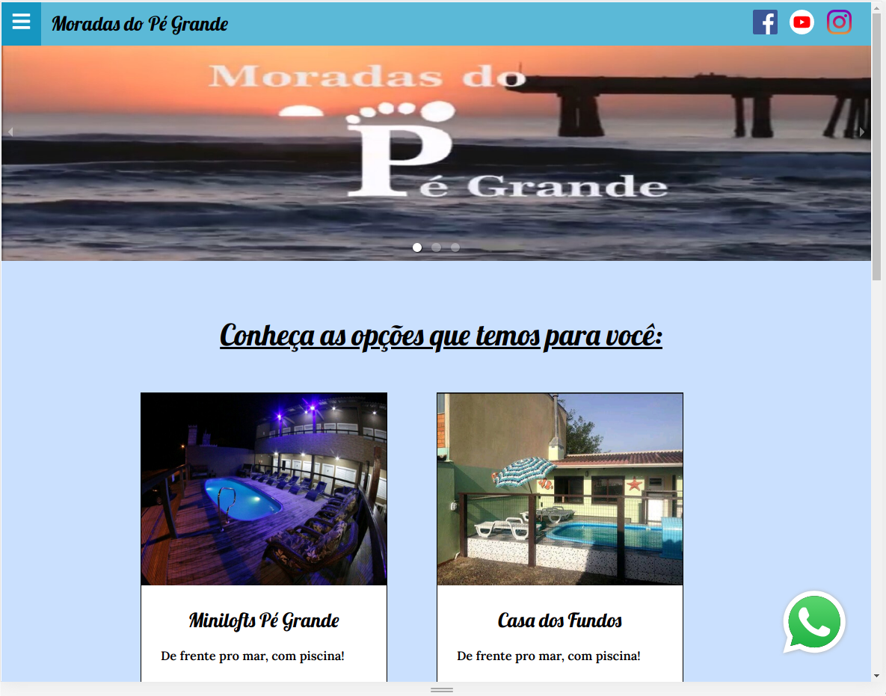

# 
 Moradas do Pé Grande 

### 
Status: em Produção 🟢 

 

  

 

## 🧪 Tecnologias

Esse projeto foi desenvolvido com as seguintes tecnologias:

- [Javascript](https://developer.mozilla.org/pt-BR/docs/Web/JavaScript)
- [Gatsby](https://www.gatsbyjs.com/)

## 🚀 Como executar

- Clone o repositório
- Instale as dependências com `yarn`
- Inicie a aplicação com `yarn start`

Agora você pode acessar [`localhost:8000`](http://localhost:8000) do seu navegador.

## 💻 Projeto

O site Moradas do Pé Grande foi desenvolvido para apresentar as opções de hospedagem oferecidas pelo proprietário do negócio.

## 
Estrutura do site

#### 1. Cabeçalho com o nome da Moradas do Pé Grande e logo com link das redes sociais.
#### 2. Página inicial com banner do carrousel de fotos e todas as opções de moradas.
#### 3. Cards com todas as opções de hospedagens
#### 4. Vídeo do youtube da Moradas.
#### 5. Contato por whatsapp
#### 6. Cada morada possui sua página descritiva com fotos, orientações gerais e um vídeo.
#### 7. Rodapé com as redes sociais e contato do desenvolverdor.
#

## 🔖 Layout

Para visualizar o site, [acesse aqui!](https://www.moradasdopegrande.com.br)

